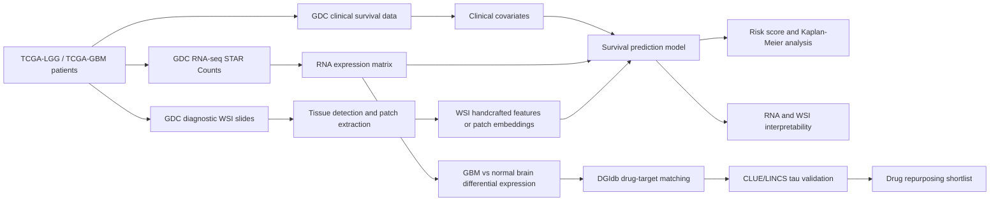

# TCGA LGG/GBM WSI + RNA Survival Project

Interpretable multimodal survival prediction for glioma using TCGA whole-slide pathology images, RNA-seq expression, and clinical covariates.

## Project Overview

This project is a research prototype for **translational glioma analysis**. It connects patient-level survival prediction, pathology-image interpretation, RNA risk-gene interpretation, and drug-repurposing candidate ranking in one dashboard.

In practical terms, the dashboard is designed to answer four questions:

1. Can RNA expression and clinical features estimate a glioma patient's survival risk?
2. Does adding WSI pathology information improve or explain the prediction?
3. Which genes and image regions are associated with high-risk prediction?
4. Which existing drugs may be worth reviewing as GBM drug-repurposing candidates?

## Analysis Flow



## Dashboard Views

| View | What it shows | Why it matters |
|---|---|---|
| Risk Prediction | RNA table upload, clinical input cells, optional WSI image registration, predicted risk group and risk score | Demonstrates how a new patient-like case can be passed into the prototype inference engine. |
| Model Performance & Survival | C-index comparison, Kaplan-Meier curves, RNA risk-gene contribution plots | Shows whether multimodal features improve survival prediction over single-modality baselines. |
| WSI Pathology | Whole-slide preview, patch samples, tissue ratio, patch-level importance overlays | Makes pathology evidence more interpretable by showing which slide regions are being inspected. |
| Drug Candidates | GBM drug-repurposing shortlist, integrated candidate table, user-added drug candidates, patient-linked drug interpretation | Connects GBM molecular findings to existing drugs and prioritizes candidates for further review. |

## Data Sources

| Source | Data used in this project | Role |
|---|---|---|
| GDC / TCGA-LGG and TCGA-GBM | Clinical survival fields, RNA-seq STAR-counts, diagnostic WSI slide files | Main patient cohort for survival modeling and pathology analysis. |
| cBioPortal PanCancer Atlas | Glioma subtype, grade, IDH/1p19q-related helper covariates | Adds clinically meaningful covariates for stratified analysis. |
| UCSC Xena Toil TCGA/GTEx | TCGA-GBM tumor expression and GTEx normal brain expression | Supports GBM-vs-normal-brain differential expression analysis. |
| DGIdb | Drug-gene interaction records | Links GBM-associated genes to existing drug candidates. |
| CLUE/LINCS | Perturbation tau scores | Checks whether a candidate drug tends to reverse the GBM expression signature. |
| PubChem / ClinicalTrials.gov | Drug property and clinical-trial evidence flags | Adds first-pass validation context for drug-repurposing candidates. |

The current GDC inventory uses **Data Release 46.0 - August 10, 2026**. The main eligible cohort contains **681 patients** with WSI, RNA, and survival information: **489 TCGA-LGG** and **192 TCGA-GBM**.

## Important Interpretation Note

This repository is a research and education prototype. The risk scores, WSI importance views, and drug candidates are not clinical recommendations. Drug-repurposing candidates require additional biological validation, toxicity review, blood-brain barrier assessment, and clinical evidence review.

## Current Data Cohort

See `outputs/data_inventory.md` for the exact GDC release, cohort counts, and generated manifests.

Recommended startup path:

1. Build and verify the GDC inventory.
2. Download the 20-patient RNA dev subset.
3. Build a patient-level RNA expression matrix.
4. Run the first Cox survival baseline.
5. Only then download WSI dev slides and add patch/embedding extraction.

## Setup

```bash
python3 -m venv .venv
source .venv/bin/activate
python -m pip install -U pip
python -m pip install -r requirements.txt
```

## VS Code

Open this folder in VS Code:

```text
/Users/sanghun/Documents/Codex/2026-08-27/tcga-lgg-tcga-gbm-wsi-tissue
```

The `.vscode/` workspace config is already set to use `.venv/bin/python`.

Useful commands:

- `Terminal > Run Task... > Pipeline: dev RNA smoke test`
- `Terminal > Run Task... > Pipeline: dev baseline comparison`
- `Terminal > Run Task... > Pipeline: DB setup and load`
- `Terminal > Run Task... > Pipeline: full RNA baseline`
- `Run and Debug > RNA dev: Cox baseline`

More detail: `outputs/vscode_setup.md`.

## MySQL Metadata DB

This project uses MySQL for cohort metadata, GDC file tracking, cBioPortal covariates, model runs, metrics, predictions, and artifact paths. Large RNA matrices, WSI slides, and future patch embeddings stay as files on disk.

Prerequisite: Docker Desktop must be installed and running.

```bash
cp .env.example .env
docker-compose up -d mysql adminer
python scripts/generate_mysql_load_sql.py --include-dev-results --out db/load_tcga.sql
docker-compose exec -T mysql sh -c 'mysql -u"$MYSQL_USER" -p"$MYSQL_PASSWORD" "$MYSQL_DATABASE"' < sql/schema.sql
docker-compose exec -T mysql sh -c 'mysql -u"$MYSQL_USER" -p"$MYSQL_PASSWORD" "$MYSQL_DATABASE"' < db/load_tcga.sql
docker-compose exec -T mysql sh -c 'mysql -u"$MYSQL_USER" -p"$MYSQL_PASSWORD" "$MYSQL_DATABASE"' < sql/summary.sql
```

In VS Code, use:

- `Terminal > Run Task... > Pipeline: DB setup and load`
- `Terminal > Run Task... > DB: query summary`

More detail: `outputs/mysql_setup.md`.

## GitHub Safety

Do not commit local secrets or large TCGA data. The repository is configured to ignore `.env`, local MySQL/MLflow state, downloaded GDC/WSI data, model caches, and generated result folders.

Use `.env.example` as the public template:

```bash
cp .env.example .env
```

Then edit `.env` only on your local machine. If a real password or API key was ever committed by mistake, rotate that credential before making the repository public.

## Data Commands

```bash
python work/build_gdc_inventory.py

python scripts/download_gdc_manifest.py \
  --manifest outputs/gdc_manifest_rna_dev_20_cases.tsv \
  --out-dir data/gdc/rna_dev

python scripts/build_rna_matrix.py \
  --rna-dir data/gdc/rna_dev \
  --file-map outputs/gdc_rna_file_map_dev_20_cases.tsv \
  --cases outputs/tcga_lgg_gbm_dev_20_cases.tsv \
  --out data/processed/rna_tpm_dev_20.tsv

python scripts/run_rna_cox_baseline.py \
  --rna data/processed/rna_tpm_dev_20.tsv \
  --cases outputs/tcga_lgg_gbm_dev_20_cases.tsv \
  --out-dir results/rna_dev_baseline
```

For the full RNA cohort, swap the dev manifest/file-map/case table with the `primary_overlap` versions.

## Baseline Comparison

Use the newer baseline runner for comparable Cox experiments:

```bash
python scripts/run_cox_baseline.py \
  --cases outputs/tcga_lgg_gbm_dev_20_cases.tsv \
  --feature-set clinical \
  --out-dir results/dev_clinical_baseline \
  --folds 5 \
  --penalizer 1.0

python scripts/run_cox_baseline.py \
  --cases outputs/tcga_lgg_gbm_dev_20_cases.tsv \
  --rna data/processed/rna_tpm_dev_20.tsv \
  --feature-set rna \
  --out-dir results/dev_rna_baseline_v2 \
  --n-rna-features 50 \
  --folds 5 \
  --penalizer 1.0

python scripts/run_cox_baseline.py \
  --cases outputs/tcga_lgg_gbm_dev_20_cases.tsv \
  --rna data/processed/rna_tpm_dev_20.tsv \
  --feature-set rna_clinical \
  --out-dir results/dev_rna_clinical_baseline \
  --n-rna-features 50 \
  --folds 5 \
  --penalizer 1.0

python scripts/summarize_model_runs.py --out results/dev_model_comparison.tsv
```

The full cohort task runs the same comparison after downloading/building the full RNA matrix.

If GDC download stops with a read timeout, run the same download task again. Completed files are skipped, and unfinished `.part` files are retried.

Check progress with:

```bash
python scripts/check_manifest_download.py \
  --manifest outputs/gdc_manifest_rna_star_counts_primary_overlap.tsv \
  --out-dir data/gdc/rna
```

## Smoke Test Result

The initial 20-patient dev RNA run uses `tpm_unstranded` for protein-coding genes:

- Matrix: `data/processed/rna_tpm_dev_20.tsv`
- Predictions: `results/rna_dev_baseline/rna_cox_predictions.tsv`
- Metrics: `results/rna_dev_baseline/rna_cox_metrics.tsv`

This dev subset is only for plumbing validation. Use the full RNA cohort before interpreting model performance.
